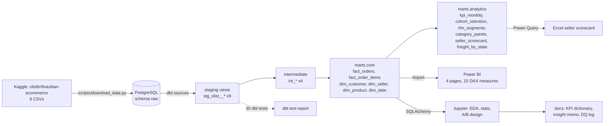

# RetailPulse: build plan

E-commerce analytics from end to end on the Olist Brazilian marketplace data: warehouse, SQL analyses, statistics, BI, and a written recommendation for the business.

> Target: a strong final-year student, about 3 weeks part-time (roughly 15 working sessions of about 3 hours each), split into **6 phases**.
> Data: the public Kaggle dataset `olistbr/brazilian-ecommerce` (core). Two more Kaggle datasets are stretch-only (§12).
> Machine: Windows. Everything here is free: PostgreSQL, dbt Core, Python, Power BI Desktop, Excel (college M365).

---

## 0. Status and working rules

### Status

| Phase | Name                                         | Resume bullet served | Status                                                | Done on    |
| ----- | -------------------------------------------- | -------------------- | ----------------------------------------------------- | ---------- |
| 1     | Setup, ingest, profile                       | 1                    | Done                                                  | 2026-10-09 |
| 2     | dbt star schema + 25+ data-quality tests     | 1                    | Done (lineage PNG + ERD PNG pending: user)            | 2026-10-09 |
| 3     | SQL analytics marts                          | 3                    | Not started                                           | –          |
| 4     | Statistics: late delivery + A/B sizing       | 2                    | Not started                                           | –          |
| 5     | Power BI dashboard + Excel scorecard         | 4                    | Not started                                           | –          |
| 6     | KPI dictionary, insight memo, README, polish | 4                    | Not started                                           | –          |

Status values: `Not started` → `In progress` → `Done` (or `Blocked: <reason>`). Update this table at the end of every phase, and append a note to `PROGRESS.md`.

### Rules

1. **One phase per prompt.** "Implement phase N" means the whole of §8 Phase N in one pass, nothing from later phases.
2. **Ask before coding.** Read this file and `PROGRESS.md` first; ask clarifying questions up front if anything is genuinely ambiguous.
3. **Implement the whole phase in one pass**, then verify. There is no stop-and-check loop inside a phase.
4. **Tests must pass before a phase is "Done"**: `ruff check .`, `pytest`, `dbt build` (when dbt code changed), and executed notebooks (when notebooks changed). See `CLAUDE.md` for the exact commands.
5. **Numbers come from the data, not from this file.** §3's values are sanity checks. If a computed number differs from the resume, the resume changes (§9).
6. **GUI-only work** (Power BI `.pbix`, Excel Power Query, screenshots, Loom) is done by the user. Claude prepares everything around it (DAX file, theme JSON, build guide, data exports) and writes step-by-step instructions.

---

## 1. Pitch (one paragraph)

RetailPulse turns Olist's raw marketplace export (100K orders across 9 relational tables, 2016–2018) into the kind of analytics stack a real e-commerce data team runs. A **dbt-tested PostgreSQL star schema** (2 fact, 4 dimension tables, 25+ tests) feeds three things: a **SQL analytics layer** (KPIs, cohort retention, RFM segments, category Pareto, seller scorecard, freight by state), a **statistics notebook** that measures how much late deliveries hurt review scores (two-proportion z-test plus logistic regression with controls) and sizes an A/B test for a fix, and a **4-page Power BI dashboard** with 15 DAX measures and seller drill-through, plus an Excel seller scorecard. It ends where a business analyst's work ends: a **KPI dictionary** and a **1-page insight memo** with 4 quantified recommendations. Olist's own Business Science & Analytics team used these same tables as its take-home test for data roles (github.com/olist/work-at-olist-data), which makes it a recognisable brief and not a toy dataset.

## 2. Why it matters for DA / BA / DS hiring

| What current JDs ask for                                       | Where RetailPulse proves it                                                                                                                   |
| -------------------------------------------------------------- | --------------------------------------------------------------------------------------------------------------------------------------------- |
| SQL: joins, CTEs, window functions                             | `marts/analytics/*.sql`: cohort (`MIN() OVER`), Pareto (`SUM() OVER (ORDER BY …)`), RFM (`NTILE`), MoM (`LAG`), seller ranks (`PERCENT_RANK`) |
| Power BI + DAX, data modeling                                  | Star schema imported into Power BI, 15 named DAX measures, drill-through page, marked date table                                              |
| Excel (Power Query, PivotTables, XLOOKUP)                      | `excel/seller_scorecard.xlsx`                                                                                                                 |
| Statistics, hypothesis testing, A/B testing                    | `02_late_delivery_stats.ipynb` (z-test, chi-square, Mann–Whitney, logit) and `03_ab_test_design.ipynb` (power analysis, A/A simulation)       |
| ETL/ELT, data warehousing, data quality                        | Raw → staging → marts in dbt, 30 dbt tests, a data-quality log                                                                                |
| KPIs, dashboards, business insights, stakeholder communication | KPI dictionary, 1-page memo, recommendation → experiment design                                                                               |
| E-commerce domain (GMV, AOV, conversion, LTV KPIs)             | GMV, AOV, repeat rate, delivery SLA, seller and category economics                                                                            |

The two internships already show engineering rigour. RetailPulse is what proves the **analyst** half.

## 3. Data: sources and verified facts

### Data at a glance

| #   | Dataset                                          | Where to get it                                                                                                                                 | Licence         | Role                                                                      |
| --- | ------------------------------------------------ | ----------------------------------------------------------------------------------------------------------------------------------------------- | --------------- | ------------------------------------------------------------------------- |
| 1   | **Brazilian E-Commerce Public Dataset by Olist** | Kaggle `olistbr/brazilian-ecommerce` (https://www.kaggle.com/datasets/olistbr/brazilian-ecommerce). Mirror: github.com/olist/work-at-olist-data | CC BY-NC-SA 4.0 | **Core (Phases 1–6).** 9 relational tables, 99,441 orders (2016–2018)     |
| 2   | Marketing Funnel by Olist                        | Kaggle `olistbr/marketing-funnel-olist`                                                                                                         | CC BY-NC-SA 4.0 | **Stretch only** (§12.1). 8,000 seller leads, 842 closed deals            |
| 3   | Brazilian Cities (IBGE)                          | Kaggle `crisparada/brazilian-cities`                                                                                                            | CC BY-SA 4.0    | **Stretch only** (§12.2). State population and GDP for per-capita metrics |

Download: `kaggle datasets download -d <ref> -p data/raw --unzip` (needs `kaggle.json` in `%USERPROFILE%\.kaggle\`). Fallback for dataset 1, no token needed: `https://raw.githubusercontent.com/olist/work-at-olist-data/master/datasets/<file>.csv`.

### 3a. Core: Brazilian E-Commerce Public Dataset by Olist

**Licence:** CC BY-NC-SA 4.0. Non-commercial portfolio use with attribution is fine; add a "Data: Olist, CC BY-NC-SA 4.0" line in the README. **Never commit the raw CSVs**; ship a download script.

| File                                    | Rows (verified with pandas) | Key / notes                                                                                                                                    |
| --------------------------------------- | --------------------------: | ---------------------------------------------------------------------------------------------------------------------------------------------- |
| `olist_orders_dataset.csv`              |                      99,441 | `order_id` PK. 8 statuses: delivered 96,478, shipped 1,107, canceled 625, unavailable 609, invoiced 314, processing 301, created 5, approved 2 |
| `olist_customers_dataset.csv`           |                      99,441 | `customer_id` is **per order**. `customer_unique_id` (96,096 distinct) is the real person                                                      |
| `olist_order_items_dataset.csv`         |                     112,650 | PK (`order_id`, `order_item_id`); up to 21 items per order; 1,278 orders have more than one seller                                             |
| `olist_order_payments_dataset.csv`      |                     103,886 | credit_card 76,795, boleto 19,784, voucher 5,775, debit_card 1,529, not_defined 3                                                              |
| `olist_order_reviews_dataset.csv`       |                      99,224 | **814 duplicate `review_id` rows**; 547 orders have more than one review; 41% have a comment text (Portuguese)                                 |
| `olist_products_dataset.csv`            |                      32,951 | 73 categories, **610 products with a null category**; column names misspelled (`product_name_lenght`)                                          |
| `olist_sellers_dataset.csv`             |                       3,095 | `seller_id`, zip prefix, city, state                                                                                                           |
| `olist_geolocation_dataset.csv`         |                   1,000,163 | Only 19,015 distinct zip prefixes, many points per prefix. Aggregate before joining.                                                           |
| `product_category_name_translation.csv` |                          71 | **2 categories missing**: `pc_gamer`, `portateis_cozinha_e_preparadores_de_alimentos` (fix with a seed)                                        |

- Purchase timestamps run **2016-09-04 → 2018-10-17**. Sep–Dec 2016 is sparse (329 orders, zero in Nov 2016) and Sep–Oct 2018 is truncated (20 orders). **Trend charts use Jan 2017 – Aug 2018 only**; the KPI dictionary records this.
- 27 customer states (UFs) → Brazil's 5 regions via a small seed.
- Other quirks for the DQ log: 8 orders "delivered" with no delivered date, 160 orders with null `approved_at`, 775 orders with no items, 1 order with no payment.

**Sanity-check values** (computed 2026-10-07, pandas). Recompute and report **your** numbers; these only tell you when something is off.

| Metric                                         |                                                             Value | Definition used                                                                                                         |
| ---------------------------------------------- | ----------------------------------------------------------------: | ----------------------------------------------------------------------------------------------------------------------- |
| Late-delivery share                            |                                            6.77% (6,534 / 96,470) | delivered orders with a delivered date; late = `delivered_date::date > estimated_date::date`                            |
| 1-star review rate, late vs on time            |                         53.8% vs 6.6% (**8.1x**; odds ratio ≈ 16) | latest review per order                                                                                                 |
| Mean review score, late vs on time             |                                                      2.27 vs 4.29 | same                                                                                                                    |
| Repeat-purchase rate                           |                                   3.0% (2,801 / 93,350 customers) | `customer_unique_id` with ≥2 delivered orders                                                                           |
| Average month-1 cohort retention               |                                                            ≈0.46% | cohorts with ≥500 customers                                                                                             |
| GMV (item price, delivered)                    |                                                           R$13.2M | excludes freight                                                                                                        |
| AOV (item price)                               |                                                            ≈R$137 | per order                                                                                                               |
| Freight share of (price + freight)             |                                14.2% overall; SP 12.2% → RR 22.2% | by customer state                                                                                                       |
| Late share by state                            |                           SP 4.5% vs AL 21.4%, MA 17.4%, SE 15.2% |                                                                                                                         |
| Median actual vs promised delivery time        |                                                 10.2 vs 23.2 days | estimates are padded, yet 6.8% still arrive late                                                                        |
| Category Pareto                                |                          17 of 73 categories make 80% of item GMV | all items, Portuguese names, **null category excluded**. With the null group kept it's 18 of 74. Pick one and state it. |
| Seller Pareto                                  |                 544 of 3,095 sellers (17.6%) make 80% of item GMV |                                                                                                                         |
| Worst-decile sellers by late rate (≥20 orders) | 82 sellers: 5.3% of seller-orders but 13.3% of late seller-orders |                                                                                                                         |
| YoY order growth, Jan–Aug                      |                              22,968 (2017) → 53,991 (2018), +135% |                                                                                                                         |

## 4. Tech stack

| Layer                    | Tool                                                                                             | Notes for Windows                                                |
| ------------------------ | ------------------------------------------------------------------------------------------------ | ---------------------------------------------------------------- |
| Warehouse                | PostgreSQL 16+ (EDB installer, includes pgAdmin)                                                 | Power BI and Excel both connect natively                         |
| Transform + tests + docs | dbt Core + `dbt-postgres`, package `dbt_utils`                                                   | `dbt docs generate` gives the lineage graph                      |
| Load                     | `psql \copy` via `scripts/load_raw.ps1`                                                          | Faster and more transparent than pandas `to_sql`                 |
| Analysis                 | Python 3.12: pandas, NumPy, SciPy, statsmodels, scikit-learn, Matplotlib, Seaborn, Jupyter       | statsmodels gives proper p-values, CIs and marginal effects      |
| Code quality             | `ruff` (lint), `pytest` (loader + sanity-number tests), `nbconvert` (execute notebooks headless) | Run at the end of every phase                                    |
| BI                       | Power BI Desktop (free)                                                                          | Import mode from Postgres. Ship `.pbix`, PDF export, screenshots |
| Spreadsheet              | Excel (college M365) with Power Query                                                            | Seller scorecard workbook                                        |
| Version control          | Git + GitHub (`SudevOP1/RetailPulse`)                                                            | `.gitignore` raw data, `.env`, `profiles.yml`, `dbt/target/`     |

## 5. Architecture



## 6. Repository structure

```
RetailPulse/
├── README.md  PLAN.md  PROGRESS.md  CLAUDE.md
├── requirements.txt               # dbt-core, dbt-postgres, pandas, numpy, scipy, statsmodels, scikit-learn,
│                                  # matplotlib, seaborn, sqlalchemy, psycopg[binary], jupyter, nbconvert,
│                                  # python-dotenv, kaggle, pytest, ruff
├── pyproject.toml                 # ruff + pytest config
├── .env.example                   # PGHOST, PGPORT, PGDATABASE, PGUSER, PGPASSWORD
├── .gitignore                     # data/raw/, .env, .venv/, dbt/retailpulse/target/, logs/, profiles.yml
├── run.ps1                        # one-shot: download → load → dbt build → export
├── scripts/
│   ├── download_data.py           # Kaggle API, GitHub raw fallback
│   ├── 00_create_raw_schema.sql   # CREATE SCHEMA raw; 9 CREATE TABLE (all text)
│   ├── load_raw.ps1               # psql \copy for each CSV
│   ├── db.py                      # shared SQLAlchemy engine from .env
│   └── export_marts.py            # marts.analytics → exports/*.csv (Excel/PBI fallback)
├── tests/                         # pytest
│   ├── conftest.py                # DB engine fixture; skips DB tests if Postgres unreachable
│   ├── test_raw_counts.py         # Phase 1: raw row counts == §3a
│   ├── test_core_marts.py         # Phase 2: fact/dim row counts, grains
│   ├── test_sanity_numbers.py     # Phase 3: analytics marts within tolerance of §3a
│   └── test_stats.py              # Phase 4: power-analysis + helper functions
├── dbt/retailpulse/
│   ├── dbt_project.yml  packages.yml  profiles.yml.example
│   ├── seeds/  state_region.csv  category_translation_patch.csv
│   ├── models/
│   │   ├── staging/      _sources.yml  _staging.yml  stg_olist__*.sql (9)
│   │   ├── intermediate/ int_order_items_agg.sql  int_order_payments_agg.sql
│   │   │                 int_order_reviews_latest.sql  int_zip_geolocation.sql
│   │   └── marts/
│   │       ├── core/       _core.yml  dim_*.sql (4)  fact_orders.sql  fact_order_items.sql
│   │       └── analytics/  _analytics.yml  kpi_monthly.sql  cohort_retention.sql  rfm_segments.sql
│   │                       category_pareto.sql  seller_scorecard.sql  freight_by_state.sql
│   └── tests/            assert_delivered_after_purchase.sql  assert_payments_match_items.sql
├── notebooks/  01_eda.ipynb  02_late_delivery_stats.ipynb  03_ab_test_design.ipynb
├── powerbi/    RetailPulse.pbix  RetailPulse.pdf  screens/*.png  dax_measures.md  theme.json  BUILD_GUIDE.md
├── excel/      seller_scorecard.xlsx  BUILD_GUIDE.md
├── exports/    *.csv  (small, analytics marts only)
└── docs/       kpi_definitions.md  insight_memo.md  insight_memo.pdf  data_quality_log.md
                erd.png  dbt_lineage.png  img/*.png
```

## 7. Phase overview

| Phase | Name                                         | Sessions (~3h) | Cumulative | Resume bullet | Done when                                                                                 |
| ----- | -------------------------------------------- | -------------: | ---------: | ------------- | ----------------------------------------------------------------------------------------- |
| 1     | Setup, ingest, profile                       |            1.5 |        1.5 | 1             | `dbt debug` passes; 9 raw tables loaded, counts match §3a; EDA part 1 + DQ log started    |
| 2     | dbt star schema + 25+ data-quality tests     |              3 |        4.5 | 1             | 2 fact + 4 dim tables; `dbt build` ERROR=0 with ≥25 tests, dup-review test WARNs; lineage |
| 3     | SQL analytics marts                          |              2 |        6.5 | 3             | 6 analytics models; 3% repeat rate and 17/73 Pareto reproduced; sanity tests pass         |
| 4     | Statistics: late delivery + A/B sizing       |              2 |        8.5 | 2             | z-test, logit with AME, power analysis written up; 6.8% / 54% vs 7% / 8x reproduced       |
| 5     | Power BI dashboard + Excel scorecard         |            3.5 |         12 | 4             | 4 pages, 15 measures, drill-through works; xlsx refreshes cleanly                         |
| 6     | KPI dictionary, insight memo, README, polish |              3 |         15 | 4             | memo fits 1 page with 4 quantified recs; §13 checklist ticked; resume numbers finalised   |

Week 1 = Phases 1–3, week 2 = Phases 4–5, week 3 = Phase 6 (+ stretch if time). If time runs short, cut the Excel scorecard's Lookup sheet first, then the A/A simulation. **Never cut** the dbt tests, the stats notebook or the memo; they carry the resume claims.

## 8. Phases in detail

Each phase lists: **goal**, **tasks**, **deliverables**, **verification** (commands that must pass), and the **user-only** steps Claude can't do.

---

### Phase 1: Setup, ingest, profile (1.5 sessions)

**Goal.** A working Postgres + dbt + Python environment, all 9 raw tables loaded as text, a first profile of the data.

**Tasks**

1. Postgres: database `retailpulse`, role `rp_user`. Credentials in `.env` (template `.env.example`).
2. Python: `py -3.12 -m venv .venv; .\.venv\Scripts\Activate.ps1; pip install -r requirements.txt`. `pyproject.toml` with ruff + pytest config.
3. dbt: `dbt init retailpulse` inside `dbt/`. `profiles.yml` lives in `~/.dbt/` (commit only `profiles.yml.example`): type postgres, schema `dev`, threads 4. `packages.yml` with `dbt-labs/dbt_utils` 1.x, `dbt deps`, `dbt debug`.
4. `scripts/download_data.py`: Kaggle API first, GitHub raw fallback; saves to `data/raw/`; idempotent (skips existing files).
5. `scripts/00_create_raw_schema.sql`: `raw.<table>` with **all columns as text** (ELT pattern: load first, type in staging; worth saying in interviews).
6. `scripts/load_raw.ps1`: truncate + `\copy … CSV HEADER ENCODING 'UTF8'` per table. Reviews CSV has embedded newlines in quoted fields; `\copy … CSV` handles them, so expect 99,224 rows, not the `wc -l` count.
7. `scripts/db.py`: SQLAlchemy engine from `.env`, reused by notebooks, tests and exports.
8. `tests/conftest.py` + `tests/test_raw_counts.py`: assert the 9 row counts in §3a.
9. `notebooks/01_eda.ipynb` part 1: row counts, null % per column, distinct counts, min/max dates, orders-per-month bar, review-score countplot, delivery-days histogram.
10. `docs/data_quality_log.md`: every quirk from §3a, each with a decision (drop / keep / fix / flag) and the phase that implements it.
11. README skeleton; GitHub repo `SudevOP1/RetailPulse`.

**Deliverables.** `requirements.txt`, `pyproject.toml`, `.env.example`, `.gitignore`, `scripts/*`, `tests/test_raw_counts.py`, dbt project scaffold, `01_eda.ipynb` (part 1), `docs/data_quality_log.md`, README skeleton.

**Verification.** `dbt debug` OK; `pytest tests/test_raw_counts.py` passes; `ruff check .` clean; `01_eda.ipynb` executes headless.

**User-only.** Install PostgreSQL (EDB installer) if missing, set the superuser password, place `kaggle.json`, create the GitHub repo if `gh` isn't authenticated.

---

### Phase 2: dbt star schema + 25+ data-quality tests (3 sessions)

**Goal.** Resume bullet 1: "Modeled 100K Olist e-commerce orders from 9 raw tables into a PostgreSQL star schema with dbt (2 fact, 4 dimension tables), enforcing 25+ data-quality tests that flagged duplicate reviews."

**Staging** (one view per source table: rename, cast, trim, lowercase categoricals, no joins):

- `stg_olist__orders`: cast 5 timestamps; `order_status` lowercase.
- `stg_olist__customers`: zip prefix stays **text** (leading zeros).
- `stg_olist__order_items`: `price`, `freight_value` numeric(10,2); `shipping_limit_date` timestamp.
- `stg_olist__payments`, `stg_olist__reviews` (score int, 2 timestamps), `stg_olist__products` (fix misspelled columns; `left join` the translation table **plus** seed `category_translation_patch.csv`; `coalesce(category_en, 'unknown')`).
- `stg_olist__sellers`, `stg_olist__geolocation`, `stg_olist__category_translation`.

**Seeds.** `state_region.csv` (27 UFs → 5 regions), `category_translation_patch.csv` (2 rows).

**Intermediate**

- `int_order_items_agg` (1 row/order): `items_count`, `sellers_count`, `items_value = sum(price)`, `freight_value = sum(freight_value)`.
- `int_order_payments_agg` (1 row/order): `payment_value`, `max_installments`, `payment_type_primary` (largest value via `row_number()`).
- `int_order_reviews_latest` (1 row/order): `row_number() over (partition by order_id order by review_answer_timestamp desc) = 1`. **This resolves the duplicate-review problem**; note it in the DQ log.
- `int_zip_geolocation`: `avg(lat), avg(lng)` by zip prefix (19,015 rows instead of 1M).

**Core marts (2 facts, 4 dims)**

- **`dim_date`**: `dbt_utils.date_spine` 2016-09-01 → 2018-12-31. `date_key` (yyyymmdd int), `date_day`, year, quarter, month, month_name, `year_month`, iso_week, weekday_name, is_weekend.
- **`dim_customer`** (1 row per `customer_unique_id`): `customer_key`, latest state/city/zip, `region`, lat/lng, `first_order_date`, `orders_count`.
- **`dim_seller`**: `seller_key`, state, city, region, lat/lng, `first_sale_date`.
- **`dim_product`**: `product_key`, `category_pt`, `category_en`, weight_g, volume_cm3, photos_qty.
- **`fact_orders`** (1 row/order, 99,441): `customer_key`, `purchase_date_key`, `order_status`, 5 timestamps, `items_count`, `sellers_count`, `items_value`, `freight_value`, `order_value`, `payment_value`, `payment_type_primary`, `max_installments`, `is_delivered`, `delivery_days`, `promised_days`, `days_late`, `is_late` (null when not delivered / no date), `review_score`, `is_one_star`, `has_review_comment`, `customer_state`, `customer_region`.
- **`fact_order_items`** (1 row/item, 112,650): `order_id`, `order_item_id`, `product_key`, `seller_key`, `customer_key`, `purchase_date_key`, `price`, `freight_value`, `is_delivered`, `is_late`, `review_score`.

Materialization: staging = view, intermediate = view (or ephemeral), marts = table. Schemas: `staging`, `intermediate`, `marts`.

**The 30 dbt tests** (resume says "25+"; count them in the `dbt build` summary):

| #     | Model.column                                                     | Test                                                                                                                                      |
| ----- | ---------------------------------------------------------------- | ----------------------------------------------------------------------------------------------------------------------------------------- |
| 1–2   | source orders.order_id                                           | unique, not_null                                                                                                                          |
| 3–4   | stg_olist\_\_orders.order_id                                     | unique, not_null                                                                                                                          |
| 5     | stg_olist\_\_orders.order_status                                 | accepted_values (8 statuses)                                                                                                              |
| 6–7   | stg_olist\_\_customers.customer_id                               | unique, not_null                                                                                                                          |
| 8     | stg_olist\_\_order_items                                         | `dbt_utils.unique_combination_of_columns` (order_id, order_item_id)                                                                       |
| 9–10  | stg_olist\_\_order_items.price / freight_value                   | `dbt_utils.accepted_range` min 0                                                                                                          |
| 11–12 | stg_olist\_\_order_items.product_id / seller_id                  | relationships → products / sellers                                                                                                        |
| 13    | stg_olist\_\_payments.payment_type                               | accepted_values (5)                                                                                                                       |
| 14    | stg_olist\_\_reviews.review_score                                | accepted_values [1,2,3,4,5]                                                                                                               |
| 15    | stg_olist\_\_reviews.review_id                                   | **unique, `severity: warn`, `store_failures: true`**. _Expected_ to flag the 814 duplicate rows: the resume's "flagged duplicate reviews" |
| 16    | stg_olist\_\_reviews                                             | unique_combination (review_id, order_id)                                                                                                  |
| 17–18 | stg_olist\_\_products.product_id, stg_olist\_\_sellers.seller_id | unique                                                                                                                                    |
| 19–20 | fact_orders.order_id                                             | unique, not_null                                                                                                                          |
| 21–22 | fact_orders.customer_key / purchase_date_key                     | relationships → dim_customer / dim_date                                                                                                   |
| 23    | fact_order_items                                                 | unique_combination (order_id, order_item_id)                                                                                              |
| 24–25 | fact_order_items.product_key / seller_key                        | relationships → dim_product / dim_seller                                                                                                  |
| 26    | dim_customer.customer_key                                        | unique                                                                                                                                    |
| 27    | dim_product.category_en                                          | not_null (fails before the translation patch, passes after: documents the fix)                                                            |
| 28    | dim_date.date_key                                                | unique                                                                                                                                    |
| 29    | singular `assert_delivered_after_purchase`                       | delivered_at ≥ purchased_at for delivered orders                                                                                          |
| 30    | singular `assert_payments_match_items`                           | `abs(payment_value − order_value) > 1.0` on < 1% of orders (`severity: warn`)                                                             |

**Docs.** `description:` for every mart model and column in `_core.yml`. `dbt docs generate` → user screenshots the lineage graph to `docs/dbt_lineage.png`. ERD (dbdiagram.io) → `docs/erd.png` (Claude writes the DBML in `docs/erd.dbml`).

**Python tests.** `tests/test_core_marts.py`: `fact_orders` = 99,441 rows, `fact_order_items` = 112,650, `dim_customer` = 96,096, one row per order in `int_order_reviews_latest`, count of `dbt_test__audit` failures for test #15 = 814.

**Verification.** `dbt build` → ERROR=0, WARN includes test #15, total tests ≥ 25. `pytest`, `ruff check .` pass. Record the summary line ("PASS=… WARN=… ERROR=0") in `PROGRESS.md`.

**User-only.** Lineage screenshot from `dbt docs serve`; ERD image export from dbdiagram.io.

---

### Phase 3: SQL analytics marts (2 sessions)

**Goal.** Resume bullet 3: "Wrote SQL (CTEs, window functions) for KPIs, cohort retention, RFM segmentation and a category Pareto, showing a 3% repeat-purchase rate and 17 of 73 categories driving 80% of revenue."

Each is a dbt model in `marts/analytics/` with `not_null`/`unique` tests on keys (these add to the test count).

1. **`kpi_monthly`**: by `year_month` (Jan 2017 – Aug 2018): orders, gmv, aov, customers, on_time_rate, avg_review, one_star_rate, freight_share, `gmv / lag(gmv) over (order by year_month) - 1 as gmv_mom`. Plus a one-row **`kpi_summary`** CTE or companion model with overall repeat-purchase rate.
2. **`cohort_retention`**:
   ```sql
   with om as (
     select customer_key, date_trunc('month', purchased_at)::date as order_month
     from {{ ref('fact_orders') }}
     where order_status not in ('canceled', 'unavailable')
     group by 1, 2
   ), c as (
     select customer_key, order_month,
            min(order_month) over (partition by customer_key) as cohort_month
     from om
   ), idx as (
     select cohort_month, customer_key,
            ((extract(year from order_month) - extract(year from cohort_month)) * 12
             + extract(month from order_month) - extract(month from cohort_month))::int as month_index
     from c
   )
   select cohort_month, month_index,
          count(distinct customer_key) as active_customers,
          first_value(count(distinct customer_key)) over w as cohort_size,
          round(100.0 * count(distinct customer_key) / first_value(count(distinct customer_key)) over w, 2) as retention_pct
   from idx
   group by 1, 2
   window w as (partition by cohort_month order by month_index)
   ```
3. **`rfm_segments`**: one row per customer. Recency = days since last delivered order, as of max date + 1. **Frequency is 1 for ~97% of customers, so `NTILE(5)` on F is meaningless**: use `f_flag = frequency >= 2` and say why in the KPI dictionary. `ntile(5)` for R and M; `CASE` → ~6 segments (Champions, Loyal-lapsing, New high-value, New/promising, At-risk high-value, Hibernating).
4. **`category_pareto`**: `sum(gmv) over (order by gmv desc rows between unbounded preceding and current row) / sum(gmv) over ()` = `cum_share`; `abc_class` (A ≤ 80%, B ≤ 95%, C rest); `rank() over (order by gmv desc)`. **Decision to make here:** exclude the null category (17/73) or keep it as 'unknown' (18/74). Default: exclude, to match the resume; document in the KPI dictionary.
5. **`seller_scorecard`** (sellers with ≥ 20 orders): orders, gmv, late_rate, avg_review, one_star_rate, avg_delivery_days, `percent_rank() over (order by gmv)`, `ntile(10) over (order by late_rate)` as late_decile, `tier` (A/B/C rule in the KPI dictionary).
6. **`freight_by_state`**: customer_state, region, orders, freight_share, late_rate, avg_delivery_days, avg_promised_days.

**Also.** `scripts/export_marts.py` → `exports/*.csv`. `tests/test_sanity_numbers.py` asserts §3a values within tolerance (±1 pp for rates, ±1 for the Pareto count, ±2% for GMV). If off by more than ~1 pp, check definitions (status filter, null dates, latest-review logic) before moving on.

**Verification.** `dbt build` ERROR=0; `pytest` (incl. sanity numbers); `ruff check .`. Record repeat rate and Pareto count in `PROGRESS.md`.

---

### Phase 4: Statistics: late delivery + A/B sizing (2 sessions)

**Goal.** Resume bullet 2: "Showed late deliveries (6.8% of orders) carry an 8x higher 1-star review rate (54% vs 7%) using a z-test and controlled logistic regression; sized a follow-up A/B test via power analysis."

**`02_late_delivery_stats.ipynb`** (reads `marts.fact_orders` via `scripts/db.py`; delivered orders with a delivered date and a review):

1. **Descriptives:** late share (the 6.8%); 2×2 late × one-star; 1-star rate by `days_late` bucket (≤−7, −6..0, 1–3, 4–7, 8–14, 15+) as a dose-response line chart.
2. **Two-proportion z-test:** `proportions_ztest`; difference with 95% CI (`confint_proportions_2indep`), risk ratio (the 8x), odds ratio.
3. **Robustness:** chi-square on late × full 1–5 distribution; Mann–Whitney U on scores (ordinal, so not a t-test; explain why).
4. **Logistic regression with controls** (`statsmodels.formula.api.logit`):
   `is_one_star ~ is_late + np.log1p(items_value) + freight_ratio + items_count + C(multi_seller) + C(payment_type_primary) + promised_days + C(customer_region) + C(top_category_group)`
   Report odds ratios with 95% CIs, **average marginal effect** of `is_late` (`get_margeff()`), pseudo-R², holdout AUC (20%), VIFs.
5. **Caveats cell:** observational, not causal; residual confounding (product quality, seller behaviour); lateness can't be randomized, so the experiment tests a _mitigation_.

**`03_ab_test_design.ipynb`** (recommendation #1 as an experiment):

- Hypothesis: proactively notifying customers whose orders are predicted late (+ small voucher) lowers the 1-star rate among late orders.
- Unit: randomize at `customer_unique_id`. Primary metric: 1-star rate among late orders. Guardrails: voucher cost per order, refund rate.
- **Power analysis:** `NormalIndPower().solve_power(effect_size=proportion_effectsize(0.54, 0.49), alpha=0.05, power=0.8)` ≈ **784 late orders per arm** (5 pp MDE). At ~510 late orders/month (2018 run-rate) ≈ **3 months**; an 8 pp MDE needs ≈306/arm (~1.2 months). Show an MDE-vs-duration table and recommend one.
- **A/A simulation:** 1,000 null experiments → false-positive rate ≈ 5%. One paragraph each on sample-ratio mismatch and peeking.

**`01_eda.ipynb` part 2:** memo-ready charts with a consistent Seaborn style, saved to `docs/img/`.

Put reusable helpers (bucketing, power table) in `scripts/stats_helpers.py` so `tests/test_stats.py` can check them (e.g. power for 0.54 vs 0.49 ≈ 784 ± 5).

**Verification.** All 3 notebooks execute headless (`jupyter nbconvert --execute`); `pytest`; `ruff check .`. Record late share, 1-star rates, ratio, AME, n per arm in `PROGRESS.md`.

---

### Phase 5: Power BI dashboard + Excel scorecard (3.5 sessions)

**Goal.** First half of resume bullet 4: "Built a 4-page Power BI dashboard with 15 DAX measures and seller drill-through". Excel is in the resume's tech line, so the scorecard ships here too.

**Claude prepares** (files): `powerbi/dax_measures.md` (all 15 measures, copy-paste ready, each with a one-line purpose), `powerbi/theme.json` (one accent colour, R$ formats), `powerbi/BUILD_GUIDE.md` (click-by-click build steps for every page and visual), `excel/BUILD_GUIDE.md`, fresh `exports/*.csv` as fallback sources. Optionally add small helper marts if a visual needs them (e.g. `review_by_days_late_bucket`).

**User builds** in Power BI Desktop, following the guide:

1. Get Data → PostgreSQL (Import) → schema `marts`: the 6 core tables + `cohort_retention`, `rfm_segments`, `seller_scorecard`. If it asks for Npgsql, install it, or use `exports/*.csv`.
2. Model: one-to-many single-direction from 4 dims to both facts; **no fact-to-fact relationship**; mark `dim_date` as date table; hide keys; data categories (state, lat/lng); R$ formats.
3. **The 15 DAX measures**, in a `_Measures` table:

| #   | Measure              | DAX (sketch)                                                                                                                                                   |
| --- | -------------------- | -------------------------------------------------------------------------------------------------------------------------------------------------------------- |
| 1   | Orders               | `DISTINCTCOUNT(fact_orders[order_id])`                                                                                                                         |
| 2   | Delivered Orders     | `CALCULATE([Orders], fact_orders[is_delivered] = TRUE())`                                                                                                      |
| 3   | GMV                  | `SUM(fact_order_items[price])`                                                                                                                                 |
| 4   | Freight              | `SUM(fact_order_items[freight_value])`                                                                                                                         |
| 5   | AOV                  | `DIVIDE([GMV], [Orders])`                                                                                                                                      |
| 6   | Customers            | `DISTINCTCOUNT(fact_orders[customer_key])`                                                                                                                     |
| 7   | Repeat Purchase Rate | `DIVIDE(COUNTROWS(FILTER(VALUES(fact_orders[customer_key]), CALCULATE([Delivered Orders]) >= 2)), CALCULATE([Customers], fact_orders[is_delivered] = TRUE()))` |
| 8   | On-Time Delivery %   | `DIVIDE(CALCULATE([Delivered Orders], fact_orders[is_late] = FALSE()), CALCULATE([Delivered Orders], NOT ISBLANK(fact_orders[is_late])))`                      |
| 9   | Late Delivery %      | `1 - [On-Time Delivery %]`                                                                                                                                     |
| 10  | Avg Review Score     | `AVERAGE(fact_orders[review_score])`                                                                                                                           |
| 11  | 1-Star Rate          | `DIVIDE(CALCULATE(COUNTROWS(fact_orders), fact_orders[review_score] = 1), CALCULATE(COUNTROWS(fact_orders), NOT ISBLANK(fact_orders[review_score])))`          |
| 12  | Freight Share %      | `DIVIDE([Freight], [GMV] + [Freight])`                                                                                                                         |
| 13  | GMV MoM %            | `VAR p = CALCULATE([GMV], DATEADD(dim_date[date_day], -1, MONTH)) RETURN DIVIDE([GMV] - p, p)`                                                                 |
| 14  | Avg Delivery Days    | `AVERAGE(fact_orders[delivery_days])`                                                                                                                          |
| 15  | Seller GMV Rank      | `RANKX(ALL(dim_seller[seller_key]), [GMV], , DESC, DENSE)`                                                                                                     |

4. **Pages** (3 report pages + 1 drill-through = 4):
   - **Executive Overview:** 6 KPI cards (GMV, Orders, AOV, On-Time %, Avg Review, Repeat Rate) with MoM in tooltips; monthly GMV/orders combo (Jan 2017 – Aug 2018); GMV by region; top-10 categories; slicers for date, region, category.
   - **Customers & Retention:** cohort matrix heatmap, RFM segment bar (customers vs GMV share), repeat-rate card with a "3% → what +1 pp is worth" annotation, category Pareto chart.
   - **Delivery & Satisfaction:** late % by state, 1-star rate by days-late bucket, review distribution late vs on time (100% stacked), seller scatter (orders × late %, size = GMV). **Right-click a seller → drill through.**
   - **Seller Detail (drill-through):** seller KPI cards vs marketplace average, monthly GMV, category mix, late % trend, back button.
5. Theme, alt-text, synced date slicer. Export `powerbi/RetailPulse.pdf` + 4 PNGs at 1600 px in `powerbi/screens/`.

**Excel `excel/seller_scorecard.xlsx`** (user builds from guide):

1. Get Data → PostgreSQL `marts.seller_scorecard` (or `exports/seller_scorecard.csv`).
2. Power Query: set types, filter `orders >= 20`, conditional column `tier`, merge with `dim_seller` for state/region, load to Data Model + sheet.
3. "Pivot" sheet: region × tier PivotTable (sellers, GMV, avg late %), PivotChart, slicers.
4. "Lookup" sheet: enter a `seller_id`, `XLOOKUP` returns KPIs next to marketplace averages, red/amber/green conditional formatting.
5. Refresh All works with no manual steps; screenshot for README.

**Verification (Claude).** DAX file lists exactly 15 measures; every column referenced in DAX exists in the marts (check against `information_schema.columns`); exports regenerate; `dbt build`, `pytest`, `ruff` still green.
**Verification (user).** Page count = 4, measure count = 15, drill-through from the scatter works, card values match `PROGRESS.md` numbers.

---

### Phase 6: KPI dictionary, insight memo, README, polish (3 sessions)

**Goal.** Second half of resume bullet 4: "…plus a KPI dictionary and a 1-page insight memo giving stakeholders 4 quantified recommendations." Plus everything a recruiter sees.

**`docs/kpi_definitions.md`**: 12 KPIs; columns: KPI, business question, formula (SQL and DAX), grain, inclusions/exclusions, owner (role), caveat. Must cover:

- GMV = Σ item price for non-canceled/non-unavailable orders; _not_ Olist revenue (commission unknown). Resume says "revenue" → define it as item GMV.
- Late = delivered date > estimated date (date-level); undelivered excluded (survivorship bias).
- Repeat rate uses `customer_unique_id`, not `customer_id`.
- Trend window Jan 2017 – Aug 2018.
- RFM frequency flag (Phase 3), Pareto null-category decision, seller tier rule.

**`docs/insight_memo.md` → `insight_memo.pdf`, strictly 1 page.** Context (2 lines), 3–4 key findings with numbers, **4 recommendations**, next steps. Each rec: action, evidence, impact estimate with assumptions, how to measure. Use your own numbers:

1. **Proactive delay communication + voucher** for predicted-late orders. Evidence: 8x 1-star rate. Measure with the Phase 4 A/B design (~784 late orders/arm).
2. **Seller SLA programme** for the worst late-rate decile. Evidence: 82 sellers = 13.3% of late seller-orders, 5.3% of volume. Impact: if they matched the median late rate, marketplace late % drops by X pp (compute).
3. **Regional carrier / estimate review for the Northeast.** Evidence: AL 21%, MA 17% late vs SP 4.5%, despite 2x padded promises.
4. **Second-purchase campaign** for "New high-value" RFM customers. Evidence: 3% repeat rate. Impact: each +1 pp of repeat ≈ N orders × AOV ≈ R$X GMV/yr (show arithmetic).

Put the impact arithmetic in a small notebook cell or `scripts/memo_numbers.py` so every memo number is reproducible. PDF via Pandoc or VS Code "Markdown PDF"; confirm it's 1 page.

**README** (see §13), `run.ps1` one-shot, `docs/data_quality_log.md` final pass, resume numbers finalised (§9), repo pinned, linked from sudev.xyz, Loom recorded.

**Verification (Claude).** Full pipeline from clean: `run.ps1` → `dbt build` → `pytest` → notebooks execute; every number in memo/README/resume traces to a query or notebook cell; memo PDF is 1 page.
**User-only.** Loom, pin repo, sudev.xyz link, final resume edit.

---

## 9. How each resume number is measured and reported honestly

| Resume claim                                    | Phase | Type           | How to measure                                                                                                | Evidence                          |
| ----------------------------------------------- | ----- | -------------- | ------------------------------------------------------------------------------------------------------------- | --------------------------------- |
| 100K orders, 9 raw tables                       | 1     | Dataset fact   | `select count(*) from raw.orders` = 99,441; 9 sources in `_sources.yml`                                       | `01_eda.ipynb`, `test_raw_counts` |
| 2 fact, 4 dimension tables                      | 2     | Design fact    | `marts/core` folder                                                                                           | dbt lineage PNG                   |
| 25+ data-quality tests                          | 2     | Design fact    | `dbt build` summary ("PASS=… WARN=… ERROR=0"), 30 planned                                                     | README screenshot                 |
| tests flagged duplicate reviews                 | 2     | Dataset+design | test #15 warns with 814 failures, stored in `dbt_test__audit`                                                 | `docs/data_quality_log.md`        |
| late deliveries 6.8% of orders                  | 4     | **VERIFY**     | definition in §3a (share of delivered orders with a delivered date)                                           | `02_late_delivery_stats.ipynb`    |
| 8x higher 1-star rate (54% vs 7%)               | 4     | **VERIFY**     | ratio of proportions, with z-test and logit AME alongside                                                     | same                              |
| sized an A/B test via power analysis            | 4     | Design         | `NormalIndPower` output                                                                                       | `03_ab_test_design.ipynb`         |
| 3% repeat-purchase rate                         | 3     | **VERIFY**     | `customer_unique_id` with ≥2 delivered orders / all with ≥1                                                   | `kpi_monthly` / DAX measure #7    |
| 17 of 73 categories → 80% of revenue            | 3     | **VERIFY**     | `category_pareto` rows with `cum_share <= 0.8` + 1; null-category choice can shift by 1. Report what you get. | `category_pareto`                 |
| 4-page Power BI, 15 DAX measures, drill-through | 5     | Design fact    | count pages/measures in the `.pbix`                                                                           | screenshots, `dax_measures.md`    |
| KPI dictionary + 1-page memo, 4 recommendations | 6     | Design fact    | docs folder                                                                                                   | `docs/`                           |

Rule: if any number differs from the resume, **update the resume to your number**, never the other way round.

## 10. Resume bullets this plan makes true

```
RetailPulse | PostgreSQL, dbt, SQL, Python, statsmodels, Power BI, Excel
- Modeled 100K Olist e-commerce orders from 9 raw tables into a PostgreSQL star schema with dbt
  (2 fact, 4 dimension tables), enforcing 25+ data-quality tests that flagged duplicate reviews.   [Phase 2]
- Showed late deliveries (6.8% of orders) carry an 8x higher 1-star review rate (54% vs 7%) using a
  z-test and controlled logistic regression; sized a follow-up A/B test via power analysis.        [Phase 4]
- Wrote SQL (CTEs, window functions) for KPIs, cohort retention, RFM segmentation and a category
  Pareto, showing a 3% repeat-purchase rate and 17 of 73 categories driving 80% of revenue.       [Phase 3]
- Built a 4-page Power BI dashboard with 15 DAX measures and seller drill-through, plus a KPI
  dictionary and a 1-page insight memo giving stakeholders 4 quantified recommendations.          [Phases 5–6]
```

Alternative bullet for BA-heavy JDs (swap with bullet 3): "Identified 82 sellers (5% of volume) behind 13% of late deliveries via a SQL seller scorecard and Excel Power Query workbook, recommending an SLA programme sized at X pp fewer late orders." (VERIFY X in Phase 6.)

## 11. Interview talking points and likely questions

**Talking points (2 minutes)**

1. "I treated it like Olist's own analyst take-home: ELT into Postgres, dbt for tested models, then three consumers: SQL marts, a stats notebook and Power BI."
2. "Headline: late deliveries are only about 7% of orders but carry an 8x higher 1-star rate. Lateness can't be randomized, so I designed an A/B test of a mitigation and sized it at about 3 months of traffic."
3. "The data had traps: customer_id is per order, reviews are duplicated, 2 categories are untranslated, and the date range edges are truncated. dbt tests caught them and the DQ log records each decision."

| Question                                             | A good answer covers                                                                                                                        |
| ---------------------------------------------------- | ------------------------------------------------------------------------------------------------------------------------------------------- |
| Why a star schema rather than one wide table?        | Declared grain per fact, conformed dims shared across facts, smaller/faster BI models, simpler DAX. Name your grains exactly.               |
| Why dbt?                                             | SQL-first transforms in version control, tests as code, lineage/docs, ref-based DAG. Mention the test that intentionally warns.             |
| How did you define "late"? Never-delivered orders?   | Date-level comparison, delivered orders only, survivorship bias acknowledged, sensitivity check with `days_late > 1`.                       |
| Does lateness _cause_ 1-star reviews?                | Observational. Controls + dose-response support the link, but residual confounding remains. Test a mitigation instead.                      |
| Odds ratio 16 but risk ratio 8: why?                 | Odds diverge from probabilities when the outcome isn't rare (54%). Business audiences get risk ratios and marginal effects.                 |
| Why Mann–Whitney, not a t-test, on review score?     | 1–5 is ordinal and heavily skewed (58% 5-star).                                                                                             |
| Walk me through your cohort query.                   | `MIN() OVER (PARTITION BY customer)` → cohort month, month index, `COUNT(DISTINCT)`, `FIRST_VALUE` for size. Why `customer_unique_id`.      |
| Month-1 retention ≈0.5%. Is cohort analysis useless? | No, that's the finding: mostly one-off purchases, so the levers are acquisition and the first-to-second purchase. Also why RFM F is a flag. |
| Explain CALCULATE / filter context.                  | Modifies filter context; row vs filter context; why DIVIDE; DATEADD needs a contiguous marked date table.                                   |
| How would you size the A/B test, what can go wrong?  | Baseline, MDE, α, power → n per arm; run-rate → duration. SRM, peeking, novelty, guardrails, randomization unit.                            |
| 30 seconds with the Head of Ops?                     | The memo's top line: number, action, expected impact.                                                                                       |
| More time?                                           | Delay prediction model, Portuguese review NLP, seller funnel (§12), incremental dbt + CI.                                                   |

## 12. Stretch goals (only after Phase 6; not on the resume)

### 12.1 Seller-acquisition funnel (Marketing Funnel dataset)

8,000 MQLs (`olist_marketing_qualified_leads_dataset.csv`) and 842 closed deals (`olist_closed_deals_dataset.csv`), joined to the core data on `seller_id`. Sanity checks (2026-10-07): lead → won 10.5%; by origin unknown 16.3%, paid_search 12.3%, organic_search 11.8%, email 3.0%; median 14 days to win; 380 of 842 won sellers ever sold (R$676,851 item GMV).

Work: load to `raw.mqls` / `raw.closed_deals`; `stg_funnel__*`; tests (unique `mql_id`, relationship closed*deals → mqls, warn-level relationship to `dim_seller` that's \_expected* to warn); `seller_funnel` (1 row/MQL) and `funnel_by_origin` marts; `04_seller_funnel.ipynb` with Wilson CIs, chi-square origin × won, paid_search vs email z-test, GMV per lead. Traps: right-censoring (use deals won ≤ 2018-06-30 and "sold within 60 days"), the 8,000 are a sample, "unknown" converting best is a tracking finding, 90%-null columns aren't modelled.

Resume bullet if done (swap with bullet 3): "Traced Olist's seller-acquisition funnel (8,000 leads → 842 deals → 380 active sellers) by joining a second Kaggle dataset on seller_id, finding a 10.5% lead-to-deal rate and a ~4x win-rate gap between paid search and email (chi-square, Wilson CIs)." (VERIFY.)

### 12.2 Per-capita enrichment (Brazilian Cities dataset)

5,573 municipalities; sum `IBGE_RES_POP` and GDP to the 27 UFs; customers per 100k residents and GMV per capita next to late % and freight share. Caveat: 2010 population.

### 12.3 Others

- **Tableau Public** cohort heatmap + Brazil state map from `exports/*.csv` (a live link recruiters can click).
- **Late-delivery prediction model** on purchase-time features (distance, category, weight, promised days); report PR-AUC.
- **Review text NLP** on the 41% of Portuguese comments ("atraso", "não recebi").
- **dbt extras:** source freshness, `dbt_expectations`, exposures, incremental models, GitHub Actions CI with a Postgres service container.

## 13. README and demo checklist

- [ ] Title, one-line pitch, **"Key findings" box with your 3 numbers**
- [ ] Data source table with link, licence (CC BY-NC-SA 4.0), "raw data not committed" note
- [ ] Architecture diagram (§5) and ERD image
- [ ] dbt lineage screenshot and `dbt build` summary showing tests
- [ ] 4 Power BI screenshots and a link to `RetailPulse.pdf`
- [ ] Excel scorecard screenshot
- [ ] Links to the KPI dictionary and the 1-page memo (PDF)
- [ ] Stats summary table (p-values, CIs, AME) and the A/B sizing table
- [ ] **Loom walkthrough (≤ 3 min):** problem → model → dashboard drill-through → memo recommendation
- [ ] "How to run" in ≤ 6 commands (`run.ps1`)
- [ ] Repo pinned on GitHub, linked from sudev.xyz; resume link resolves
