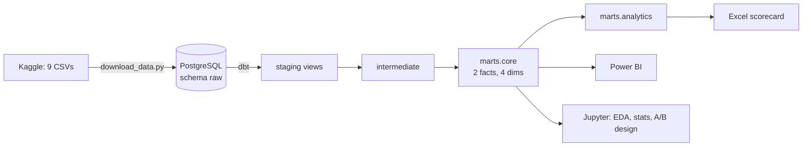

# RetailPulse

End-to-end e-commerce analytics on Olist's Brazilian marketplace data: a dbt-tested PostgreSQL star schema,
SQL analytics marts, a late-delivery statistics study with an A/B test design, a Power BI dashboard, and a
one-page insight memo.

> 🚧 Work in progress. See [PLAN.md](PLAN.md) for the build plan and [PROGRESS.md](PROGRESS.md) for status.

## Key findings

_Filled in after Phases 3–4._

## Data

| Dataset                                                                           | Source                                                                                              | Licence         |
| --------------------------------------------------------------------------------- | --------------------------------------------------------------------------------------------------- | --------------- |
| Brazilian E-Commerce Public Dataset by Olist (9 tables, 99,441 orders, 2016–2018) | [Kaggle `olistbr/brazilian-ecommerce`](https://www.kaggle.com/datasets/olistbr/brazilian-ecommerce) | CC BY-NC-SA 4.0 |

Data: Olist, CC BY-NC-SA 4.0. **Raw data is not committed**; `scripts/download_data.py` fetches it
(Kaggle API, with a fallback to the [public GitHub mirror](https://github.com/olist/work-at-olist-data)).

## Architecture



## How to run

Prerequisites: PostgreSQL 16+, Python 3.12, Windows PowerShell.

```powershell
py -3.12 -m venv .venv; .\.venv\Scripts\Activate.ps1; pip install -r requirements.txt
Copy-Item .env.example .env                      # then set PGPASSWORD
.\scripts\setup_postgres.ps1                     # once: creates role + database (asks for superuser password)
python scripts/download_data.py                  # 9 CSVs -> data/raw/
.\scripts\load_raw.ps1 -CreateSchema             # raw schema + \copy all 9 tables
. .\scripts\env.ps1; cd dbt/retailpulse; dbt deps; dbt build; cd ../..
```

## Repository

| Path               | Contents                                                                    |
| ------------------ | --------------------------------------------------------------------------- |
| `scripts/`         | download, raw schema DDL, Postgres setup and load scripts, shared DB engine |
| `dbt/retailpulse/` | dbt project (staging → intermediate → marts)                                |
| `notebooks/`       | EDA, late-delivery statistics, A/B test design                              |
| `tests/`           | pytest: raw row counts, mart grains, sanity numbers                         |
| `docs/`            | [data-quality log](docs/data_quality_log.md), KPI dictionary, insight memo  |
